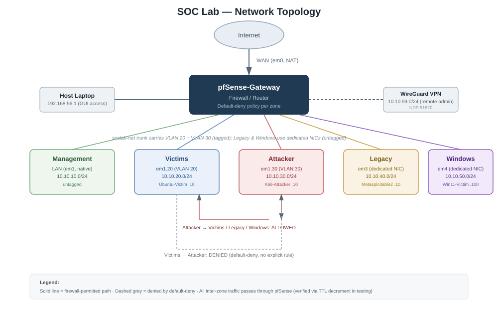

# SOC Lab Infrastructure

A fully segmented, VLAN-aware home SOC (Security Operations Center) lab built from scratch in VirtualBox — the foundation project for a series of downstream Blue Team labs (SIEM, NIDS, vulnerability scanning, incident response, attack simulation).

This repo documents **Project 1**: the network, firewall, and core VM infrastructure that every later project builds on top of.

> New to this repo? Start with [`docs/00-glossary-and-tools.md`](docs/00-glossary-and-tools.md) if any term or tool below is unfamiliar — every concept used in this build is explained there in plain language.

---

## What this is

A router-centered lab network, isolated entirely from the home network, with four distinct trust zones enforced by firewall policy rather than just documentation:

- An **attacker zone** (Kali Linux) that can reach the other zones, to simulate real attack traffic
- A **victims zone** (Ubuntu Server) representing typical modern endpoints
- A **legacy zone** (Metasploitable2) representing old, deliberately vulnerable infrastructure that can't participate in modern VLAN tagging
- A **Windows zone** (Windows 11) representing a real enterprise-style endpoint, also unable to do in-guest VLAN tagging (different reason, same solution)
- Remote administrative access over a **WireGuard VPN tunnel**, instead of exposing the firewall's GUI directly

## Status

| Component | Status |
|---|---|
| pfSense gateway + interface assignment | ✅ Working |
| VLAN segmentation (Victims, Attacker) | ✅ Working |
| Firewall aliases + inter-zone policy | ✅ Working, tested |
| WireGuard VPN remote access | ✅ Working |
| Kali-Attacker (VLAN 30 tagging) | ✅ Working, persistent |
| Ubuntu-Victim (VLAN 20 tagging) | ✅ Working, persistent |
| Metasploitable2 (dedicated Legacy zone) | ✅ Working, persistent |
| Windows 11 (dedicated Win zone + RDP) | ✅ Working, persistent |
| Full cold-boot connectivity test (all VMs) | ✅ Passed |
| Automation scripts | ⏳ Not started |

## Network Architecture

| Zone | pfSense Interface | Underlying Port | Subnet | Gateway | Tagging |
|---|---|---|---|---|---|
| Management | LAN | em1 (native/untagged) | 10.10.10.0/24 | 10.10.10.1 | No |
| Host Access | HOSTACCESS | em2 (host-only) | 192.168.56.0/24 | 192.168.56.10 | N/A |
| WireGuard VPN | WIREGUARDNET | tun_wg0 | 10.10.99.0/24 | 10.10.99.1 | N/A |
| Victims | VICTIMS | em1.20 (VLAN 20) | 10.10.20.0/24 | 10.10.20.1 | Yes |
| Attacker | ATTACKER | em1.30 (VLAN 30) | 10.10.30.0/24 | 10.10.30.1 | Yes |
| Legacy | LEGACY | em3 (dedicated NIC) | 10.10.40.0/24 | 10.10.40.1 | No |
| Windows | WIN | em4 (dedicated NIC) | 10.10.50.0/24 | 10.10.50.1 | No |

**Why some zones are tagged VLANs and some are dedicated NICs:** Kali and Ubuntu tag their own traffic (802.1Q) in the guest OS and share one trunked VirtualBox network. Metasploitable2 (too old to support VLAN tooling) and Windows 11 (VirtualBox's emulated NIC driver has no VLAN ID field) can't do this, so each gets its own dedicated, untagged VirtualBox Internal Network wired to its own pfSense NIC instead — a legitimate, common real-world pattern for hosts that can't participate in tagging. Full reasoning in [ADR-008](docs/adr/008-legacy-and-windows-zones-for-non-taggable-hosts.md).

## VM Inventory

| VM | OS | Zone | IP | Install Guide |
|---|---|---|---|---|
| pfSense-Gateway | pfSense CE 2.8.1 | Router/Firewall (all zones) | multiple | [Install guide](docs/01-hypervisor-setup.md) |
| Kali-Attacker | Kali Linux | Attacker | 10.10.30.10 | [Install guide](docs/04-installation/kali-attacker.md) |
| Ubuntu-Victim | Ubuntu Server LTS | Victims | 10.10.20.10 | [Install guide](docs/04-installation/ubuntu-victim.md) |
| Metasploitable2-Victim | Metasploitable2 (Ubuntu 8.04) | Legacy | 10.10.40.10 | [Install guide](docs/04-installation/metasploitable2-victim.md) |
| Win11-Victim | Windows 11 Pro | Windows | 10.10.50.100 | [Install guide](docs/04-installation/windows11-victim.md) |

## Documentation Map

- [`docs/00-glossary-and-tools.md`](docs/00-glossary-and-tools.md) — every tool, protocol, and term used in this build, explained
- [`docs/01-network-design.md`](docs/01-network-design.md) — architecture, zone design, firewall policy
- [`docs/02-testing.md`](docs/02-testing.md) — every connectivity/isolation test run and its result
- [`docs/04-installation/`](docs/04-installation) — step-by-step build + persistence notes per VM
- [`docs/adr/`](docs/adr) — Architecture Decision Records: the *why* behind each major design choice
- [`docs/05-lessons-learned.md`](docs/05-lessons-learned.md) — real troubleshooting stories: root causes found, not just fixes applied

## Credentials

Real credentials are **not** stored in this repo. See `credentials.local.md` (gitignored, kept on the build machine only) for actual lab logins. Every doc in this repo uses placeholder values like `<password>`.

## Tech Stack

VirtualBox · pfSense CE · Kali Linux · Ubuntu Server · Metasploitable2 · Windows 11 · WireGuard

This is Project 1 of a multi-project SOC portfolio. Later projects (Wazuh SIEM, Suricata NIDS, Greenbone/OpenVAS, TheHive/Cortex, attack simulation, Velociraptor) build on top of this infrastructure and live in their own repositories.
