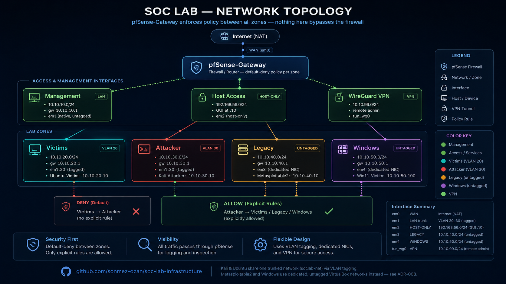

# SOC Lab Infrastructure

A segmented, VLAN-aware home SOC lab built in VirtualBox — the network and VM foundation that later projects (SIEM, IDS, vuln scanning, incident response, attack simulation) run on top of.

This is Project 1: the network, firewall, and core VMs. Nothing else lives in this repo — later tools each get their own repository.

## Overview

pfSense sits at the center and enforces policy between four zones:

- **Attacker** (Kali) — can reach the other zones, used to simulate real attack traffic
- **Victims** (Ubuntu Server) — a typical modern endpoint target
- **Legacy** (Metasploitable2) — deliberately old, can't do VLAN tagging, isolated on its own dedicated NIC instead
- **Windows** (Windows 11) — same dedicated-NIC treatment as Legacy, for a different reason (driver limitation, not age)

Remote admin access goes through a WireGuard tunnel rather than exposing the pfSense GUI directly.

## Status

| Component | Status |
|---|---|
| pfSense gateway + interfaces | Working |
| VLAN segmentation (Victims, Attacker) | Working |
| Firewall aliases + inter-zone policy | Working, tested |
| WireGuard VPN | Working |
| Kali-Attacker (VLAN 30) | Working, persistent |
| Ubuntu-Victim (VLAN 20) | Working, persistent |
| Metasploitable2 (Legacy zone) | Working, persistent |
| Windows 11 (Win zone + RDP) | Working, persistent |
| Full cold-boot connectivity test | Passed |
| Automation scripts | Done |
| Firewall config reference | Done |
| Screenshots | Shot list ready, pending capture |

## Network Architecture

| Zone | pfSense Interface | Port | Subnet | Gateway | Tagged |
|---|---|---|---|---|---|
| Management | LAN | em1 (native) | 10.10.10.0/24 | 10.10.10.1 | No |
| Host Access | HOSTACCESS | em2 (host-only) | 192.168.56.0/24 | 192.168.56.10 | N/A |
| WireGuard | WIREGUARDNET | tun_wg0 | 10.10.99.0/24 | 10.10.99.1 | N/A |
| Victims | VICTIMS | em1.20 | 10.10.20.0/24 | 10.10.20.1 | Yes |
| Attacker | ATTACKER | em1.30 | 10.10.30.0/24 | 10.10.30.1 | Yes |
| Legacy | LEGACY | em3 | 10.10.40.0/24 | 10.10.40.1 | No |
| Windows | WIN | em4 | 10.10.50.0/24 | 10.10.50.1 | No |

Kali and Ubuntu tag their own traffic (802.1Q) and share one trunked network. Metasploitable2 can't run VLAN tooling (Ubuntu 8.04, dead package repos) and Windows 11's emulated NIC driver has no VLAN ID field — both get dedicated, untagged networks instead, wired to their own pfSense interface. Reasoning in [ADR-008](docs/adr/008-legacy-and-windows-zones-for-non-taggable-hosts.md).

## VMs

| VM | OS | Zone | IP | Setup |
|---|---|---|---|---|
| pfSense-Gateway | pfSense CE 2.8.1 | all zones | — | [guide](docs/01-hypervisor-setup.md) |
| Kali-Attacker | Kali Linux | Attacker | 10.10.30.10 | [guide](docs/04-installation/kali-attacker.md) |
| Ubuntu-Victim | Ubuntu Server LTS | Victims | 10.10.20.10 | [guide](docs/04-installation/ubuntu-victim.md) |
| Metasploitable2-Victim | Metasploitable2 | Legacy | 10.10.40.10 | [guide](docs/04-installation/metasploitable2-victim.md) |
| Win11-Victim | Windows 11 Pro | Windows | 10.10.50.100 | [guide](docs/04-installation/windows11-victim.md) |

## Docs

- [`docs/00-glossary-and-tools.md`](docs/00-glossary-and-tools.md) — tools, protocols, and terms used in this build
- [`docs/02-network-design.md`](docs/02-network-design.md) — architecture and firewall policy
- [`docs/03-testing.md`](docs/03-testing.md) — connectivity and isolation tests, with results
- [`docs/04-installation/`](docs/04-installation) — per-VM build steps
- [`docs/adr/`](docs/adr) — architecture decision records
- [`docs/05-lessons-learned.md`](docs/05-lessons-learned.md) — troubleshooting notes worth keeping
- [`scripts/`](scripts) — automation to reproduce the network setup
- [`configs/`](configs) — firewall rule reference and pfSense config export instructions

## Credentials

Not in this repo. Real values live in a local, gitignored `credentials.local.md`. Every doc here uses placeholders.

## Stack

VirtualBox · pfSense CE · Kali Linux · Ubuntu Server · Metasploitable2 · Windows 11 · WireGuard

Part of a larger portfolio: Wazuh (SIEM), Suricata (NIDS), Greenbone/OpenVAS (vuln scanning), TheHive/Cortex (IR), attack simulation, Velociraptor — each in its own repo, built on this infrastructure.
